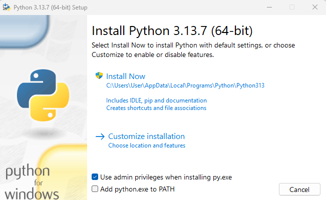
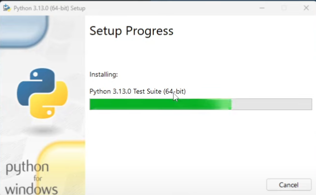
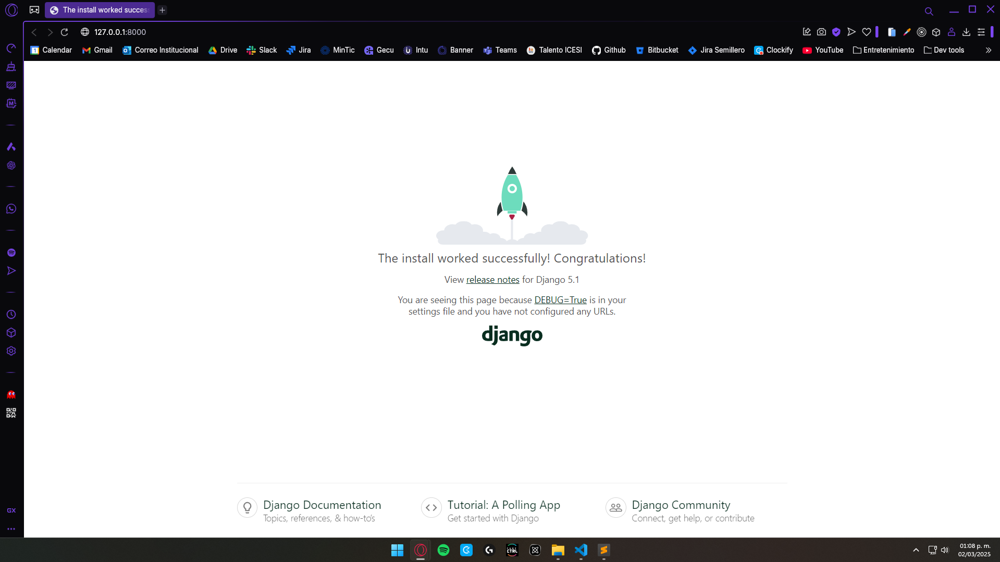

# Django TODO tutorial - Test Driven Development

## Tabla de contenidos

- [About](#about)
- [Conceptualización](#conceptualización)
  - [Qué es un Framework](#qué-es-un-framework)
  - [Utilidad de los frameworks](#utilidad-de-los-frameworks)
  - [Qué es Django](#qué-es-django)
  - [Qué es Test-Driven Development](#qué-es-test-driven-development)
  - [Por qué TDD](#por-qué-tdd)
- [Pasos](#pasos)
  - [Paso 0: Instalación de Python](#paso-0-instalación-de-python)
  - [Paso 1: Creación del proyecto](#paso-1-creación-del-proyecto)
    - [Paso 1.1: Crear entorno virtual de Python](#paso-11-crear-entorno-virtual-de-python)
    - [Paso 1.2: Activar el entorno virtual](#paso-12-activar-el-entorno-virtual)
    - [Paso 1.3: Seleccionar Python Interpreter](#paso-13-seleccionar-python-interpreter)
    - [Paso 1.4: Instalar dependencias necesarias](#paso-14-instalar-dependencias-necesarias)
    - [Paso 1.5: Crear archivo `requirements.txt`](#paso-15-crear-archivo-requirementstxt)
    - [Paso 1.6: Crear proyecto Django](#paso-16-crear-proyecto-django)
  - [Paso 2: Entendimiento de los Archivos básicos de Django](#paso-2-entendimiento-de-los-archivos-básicos-de-django)
    - [Paso 2.1: `manage.py`](#paso-21-managepy)
    - [Paso 2.2: `settings.py`](#paso-22-settingspy)
    - [Paso 2.3: `urls.py`](#paso-23-urlspy)
    - [Paso 2.4: `wsgi.py` y `asgi.py`](#paso-24-wsgipy-y-asgipy)
  - [Paso 3: Creación de la Lógica del proyecto](#paso-3-creación-de-la-lógica-del-proyecto)

---

## About

En este repo encontrarás un ejemplo básico de cómo construir una aplicación web, usando el framework de Python **Django**, para la gestión de tareas por hacer, usando la metodología Test-Driven Development.

En este documento _README_ podrás ver los pasos que debes seguir para construir la aplicación por tu cuenta. 

---

## Conceptualización

Seguramente ya sabes lo que es Python, y lo hasta puede que lo hayas usado en varios proyectos a largo de tu formación profesional. Sin embargo, puede que te preguntes qué es un **_framework_**, **_para qué sirve_**, y qué es **_Django_**. Además, puede que no tengas del todo claro **_qué es la metodología Test-Driven Development_** ni **_para qué sirve_**.


### Qué es un Framework

Para inciar, un **_framework_** puede verse como una caja de herramientas ya preparada para construir software. En lugar de empezar desde cero cada vez que quieres crear una aplicación, un **framework te da piezas listas** (estructuras, librerías, buenas prácticas) para que te concentres en lo importante: la lógica de tu aplicación.  

También, puedes entenderlo como una especie de **plantilla de trabajo**, que te dice cómo hacer u organizar ciertas partes de tus proyectos, y te otorga **utilidades** que facilitan las cosas enormemente.


### Utilidad de los frameworks

Por otro lado, los frameworks sirven para muchas cosas, como:

- **Estandarizar** la forma de hacer tus proyectos (ej. estructuras, procesos, etc.).
- **Ahorrarte esfuerzo**, pues suelen proveer código y funcionalidades ya hechas para tareas comunes (ej. autenticación, interacción con BD's, validación de estructuras de datos, etc.).
- **Evitar errores comunes** en proyectos (ej. SQL Injection, manejo de sesiones, etc.).

Estas ventajas no solo sirven para facilitarte la vida a la hora de desarrollar un proyecto, sino que proveen a tus aplicaciones de atributos de calidad, muy deseables en todo momento, como la escalabilidad o la mantenibilidad.


### Qué es Django

Por último, y debido a que este es el tema central de este tutorial, debes saber qué es **Django**.

Django es un **framework web de Python**. Esto significa que te proporciona unas bases sólidas con todo lo que necesitas para crear aplicaciones web (como páginas web, APIs, sistemas de información) de forma rápida, sencilla, segura y ordenada.

Es importante resaltar que Django es uno de los frameworks más conocidos y usados de Python. Es de código abierto (lo que significa que puedes ver su código y contribuir al [proyecto](https://github.com/django/django)), y se encuentra en funcionamiento desde julio de 2005.

Cuenta con una **estructura definida**, soporta el **Modelo Vista Controlador** (MVC) en su propia versión llamada **Modelo Template Vista** (MTV), cuenta con **ORM integrado**, incluye **protección contra ataques comunes** (XSS, CSRF, SQL Injection), y tiene varias funcionalidades dentro de sí (**panel de administración**, **autenticación**, **manejo de sesiones**, etc.).


### Qué es Test-Driven Development

**Test-Driven Development** o **Desarrollo Dirigido por Pruebas** (**TDD** por sus siglas en inglés) es una metodología de desarrollo de software en donde nos encargamos de desarrollar las pruebas del código (tests), antes de realizar la implementación de las funcionalidades per se.

TDD se basa en un **ciclo llamado Red-Green-Refactor**, donde:

- **Red**

    Se **escribe una prueba que falla** porque aún no se ha implementado el código necesario para que esta pase. 

    Le debe su nombre al color que aparecerá en tu consola cuando ejecutes la prueba y esta falle: **rojo**. 

    Ej:
    
    Supón que estás en el inicio de este proyecto, quieres realizar una funcionalidad para encontrar una tarea por su `id`, y el nombre de la función será `get_task(task_id)`. En este caso, debes crear un test que pruebe que al ejecutar `get_task(1)` te devuelva la tarea cuyo `id` es 1.

    La primera vez que ejecutes dicho test, dado que aún no existe esa función, obtendrás algo como:

    

- **Green**

    Se **escribe el mínimo código necesario** para que la prueba pase exitosamente.

    Esta fase del ciclo le debe su nombre, igual que la anterior, al color que verás en tu consola cuando vuelvas a ejecutar la prueba y esta pase: **verde**.

    Ej:

    Implementas la función:

    ```python
    def get_task(task_id):
        return db.find(task_id)
    ```

    Ahora deberías obtener algo como:

    

- **Refactor**

    Se **mejora el código**, sin cambiar su comportamiento, para que siga las mejores prácticas y pase de ser un código básico o feo, a ser un **buen código**.

    Ej:

    Limpias redundancias, eliminas malas prácticas, optimizas ciclos, etc.

    > **Nota**: Es probable que haya funcionalidades demasiado básicas que no precisen de una refactorización. En ese caso, no te alarmes. Solo ten en cuenta que necesitarás esta fase para otras funcionalidades. 


### Por qué TDD

Puede que te preguntes: _"¿Por qué debería escribir pruebas antes de programar?"_

La respuesta corta es: **porque TDD te ayuda a pensar mejor en lo que quieres construir y a escribir un código más confiable**.

Algunas razones para usar TDD son:

- **Claridad en los requisitos**

    Antes de escribir código, debes pensar en qué debería hacer tu función o módulo. Eso obliga a entender mejor el problema antes de lanzarte a programar.

- **Menos errores en producción**

    Al tener pruebas desde el inicio, evitas que cambios futuros rompan funcionalidades que ya tenías listas. Los tests actúan como una red de seguridad.

- **Código más simple y mantenible**

    Como el objetivo es hacer pasar la prueba con el mínimo código posible, se evita la tentación de escribir de más. Luego, en la fase de _Refactor_, mejoras el diseño sin miedo a dañar nada.

- **Documentación viva**

    Las pruebas son ejemplos ejecutables de cómo debe funcionar tu aplicación. Si alguien nuevo llega al proyecto, puede entender rápidamente qué hace el sistema revisando los tests.

- **Confianza para refactorizar o agregar nuevas funcionalidades**

    Puedes modificar tu código con la tranquilidad de que, si algo se rompe, los tests lo mostrarán de inmediato.

En resumen, **TDD no solo es escribir pruebas por escribir**, sino una manera de **construir software de forma más segura, ordenada y con calidad profesional**.

---

## Pasos

### Paso 0: Instalación de Python

Antes de que te pongas manos a la obra con el proyecto, debes tener instalado el lenguaje de programación sobre el que funciona Django: Python. 

Esto es imprescindible para poder crear y ejecutar el proyecto.

Antes que nada, debes verificar si ya tienes instalado el lenguaje. Para ello, abre una terminal y ejecuta el siguiente comando:

```bash
python --version
```

Si ya lo tienes instalado, obtendrás un resultado como este:

```bash
Python 3.x.x
```

> **Nota**: Si Python ya está instalado en tu dispositivo, puedes saltarte todo este paso de instalación e ir al [siguiente](#creación-del-proyecto).

Si no obtienes algo así, significa que debes instalar Python. Para hacerlo:

- Dirígete a la sección de instalación del lenguaje (en su [página oficial](https://www.python.org)) correspondiente al Sistema Operativo que estés usando:

    - [Windows](https://www.python.org/downloads/windows)
    - [Linux/Unix](https://www.python.org/downloads/source)
    - [macOS](https://www.python.org/downloads/macos)

- Descarga el instalador de la versión que prefieras.

    Por lo general, es recomendable usar la versión estable más actual, pero eso dependerá de tus necesidades personales y profesionales. 

    > **Nota**: Siempre puedes tener varias versiones de Python en el mismo dispositivo y usar la que más te convenga en cada momento.

- Ejecuta el instalador descargado.

    El instalador, como su nombre lo dice, instalará el lenguaje en tu dispositivo. Al ejecutarlo, se iniciará el proceso con esta ventana:

    

    > **Nota**: La casilla **"Add python.exe to PATH"** debes marcarla SOLO si no tenías Python instalado antes. En caso de que estés instalado una versión distinta a la que tienes actualmente, asegúrate de dejarla sin marcar. En caso de que no lo tuvieras instalado antes, es muy importante que la marques.

    Después de eso, presiona donde dice **"Install Now"**. Eso te mostrará algo así:

    

    Al terminar, verás:

    


Con esto ya tendrías Python instalado. Puedes verificarlo abriendo una nueva terminal y ejecutando:

```bash
python --version
```

---

### Paso 1: Creación del proyecto

Para inicializar el proyecto deberás seguir estos pasos:

---

#### Paso 1.1: Crear entorno virtual de Python

Crear un entorno virtual en Python te permite trabajar en un ambiente aislado, gestionando de manera independiente las dependencias de cada proyecto. Esto evita conflictos entre versiones de librerías y garantiza un entorno más ordenado y controlado.

Usa este comando para crearlo:

```bash
python -m venv venv
```

> **Nota:** El entorno puede tener el nombre que desees. En este caso, uso `venv` por convención. Además, es necesario que crees el entorno en la carpeta raíz del proyecto.

---

#### Paso 1.2: Activar el entorno virtual

Una vez creado el entorno virtual, es preciso activarlo dentro de la consola que usarás para manejar y ejecutar tu proyecto. 

Usa este comando para activarlo:

```bash
./venv/Scripts/activate
```

> **Nota:** Reempla `venv` con el nombre que hayas escogido para tu entorno.

---

#### Paso 1.3: Seleccionar Python Interpreter

Una vez creado, y activado, el entorno virtual, es importante asegurarse de que tu editor o IDE utilice el intérprete correcto. Esto garantiza que las dependencias instaladas en el entorno virtual sean reconocidas y usadas en tu proyecto.

En Visual Studio Code (VS Code) debes hacer lo siguiente:

- Abrir el **Command Palette** presionando `Ctrl + Shift + P`.
- Escribir "Python: Select Interpreter" y presionar `Enter`.
- Buscar el intérprete correspondiente al entorno creado. Suele estar marcado con la palabra `Recommended`.
- Seleccionar el intérprete.

---

#### Paso 1.4: Instalar dependencias necesarias

Ahora que tu entorno está preparado, deberás instalar las dependencias necesarias para usar Django.

Ve a la consola, en VSCode puedes hacer presionando `Ctrl + J`, y ejecuta:

```bash
pip install django
```

> **Nota:** Asegúrate de ejecutar este comando en la consola donde el entorno virtual esté activado. En VS Code, puedes verificarlo al inicio de cada línea de la terminal, donde debería aparecer el nombre del entorno entre paréntesis, por ejemplo: `(venv) PS E:\WORKSPACE (PC)\django-todo-tutorial>`.

Ahora puedes verificar la versión instalada de Django usando el comando:

```bash
django-admin --version
```

---

#### Paso 1.5: Crear archivo `requirements.txt`

El archivo [`requirements.txt`](requirements.txt) es una lista de todas las dependencias de tu proyecto. Guardar esta lista permite que otras personas (o tú mismo en otro momento) puedan instalar fácilmente las mismas versiones de las librerías necesarias. Es importante destacar que el entorno virtual, donde se instalan estas dependencias, **no debería** subirse al repositorio o sistema de control de versiones, por lo que este archivo es clave para reproducir el entorno de trabajo correctamente.

Para generarlo:

```bash
pip freeze > requirements.txt
```

> **Nota:** Este comando creará un archivo con el nombre `requirements.txt`, en caso de que no exista, con los nombres de las librerías que tengas instaladas en tu entorno virtual. En caso de que el archivo ya exista, agregará las nuevas librerías que no estén listadas en dicho archivo. 

> **Importante:** Ejecutar este comando cada vez que hagas la instalación de nuevas librerías para mantener el archivo de requerimentos actualizado.

Para instalar las dependencias desde el archivo (en otra máquina, por ejemplo):

```bash
pip install -r requirements.txt
```

---

#### Paso 1.6: Crear proyecto Django

Hasta este punto, todo lo que has hecho es preparar tu entorno de desarrollo. Sin embargo, es necesario que crees tu proyecto de Django, donde estará todo el código de tu aplicación.

Para crearlo, ejecuta:

```bash
django-admin startproject todo_app .
```

> **Nota:** En este caso, el nombre del proyecto es `todo_app`. Sin embargo, puedes nombrarlo como desees, dependiendo de su propósito y funcionalidad.

Ahora, puedes ejecutar tu proyecto para verificar que todo esté bien:

```bash
python manage.py runserver
```

> **Nota:** Al ejecutar este comando, verás información relevante sobre tu proyecto, incluyendo la URL local para acceder a él (generalmente `http://127.0.0.1:8000/`). Es normal que, al correr el proyecto por primera vez, la consola muestre texto en rojo indicando que hay migraciones pendientes. No te preocupes, esto solo significa que debes aplicarlas antes de continuar (lo verás más adelante en el tutorial).

Al abrir la URL, deberías ver algo así:


---

### Paso 2: Entendimiento de los Archivos básicos de Django

Al crear un proyecto en Django, se genera una estructura de archivos que permite su correcto funcionamiento. A continuación, te explico el propósito de cada uno:

---

#### Paso 2.1: [`manage.py`](manage.py)

Este archivo es el punto de entrada para interactuar con el proyecto desde la línea de comandos. Permite ejecutar comandos clave como iniciar el servidor, aplicar migraciones y crear aplicaciones.

De hecho, ya lo usaste, en el último paso de la sección anterior, para ejecutar el proyecto.

---

#### Paso 2.2: [`settings.py`](todo_app/settings.py)

Este archivo contiene la configuración principal del proyecto Django. Aquí se definen aspectos clave como la base de datos, las aplicaciones instaladas, la configuración de seguridad y los archivos estáticos.

Algunas de las principales configuraciones que se pueden establecer en este archivo son:

- `INSTALLED_APPS`: Lista de aplicaciones activas en el proyecto (lo verás más adelante).
- `DATABASES`: Configuración de la base de datos del proyecto. Por defecto, Django crea y configura una de SQLite, llamada `db.sqlite3`, pero puedes cambiarlo para que use la que prefieras (incluso NoSQL).
- `MIDDLEWARE`: Conjunto de procesos que se ejecutan en cada petición antes de llegar a la vista.
- `TEMPLATES`: Configuración para los archivos HTML del proyecto.
- `STATIC_URL`: Ruta para archivos estáticos como CSS, JavaScript e imágenes.

Al cambiar este archivo, cambias la configuración del proyecto. Por ejemplo, puedes configurar una BD distinta:

```python
DATABASES = {
    'default': {
        'ENGINE': 'django.db.backends.postgresql',
        'NAME': 'mi_base_de_datos',
        'USER': 'mi_usuario',
        'PASSWORD': 'mi_contraseña',
        'HOST': 'localhost',
        'PORT': '5432',
    }
}
```

---

#### Paso 2.3: [`urls.py`](todo_app/urls.py)

En este archivo se definen las rutas del proyecto. Básicamente, se define la vista que se debe ejecutar cuando se acceda a cada URL dentro de la aplicación.

Incialmente, este archivo contiene la ruta al panel de administración: `/admin/`. Las nuevas rutas se deben agregar a la lista `urlpatterns`.

---

#### Paso 2.4: `wsgi.py` y `asgi.py`

Estos archivos son puntos de entrada para que servidores web ejecuten el proyecto Django.

[`wsgi.py`](todo_app/wsgi.py) (Web Server Gateway Interface): Es el archivo que Django usa por defecto para desplegar el proyecto en servidores tradicionales, como Apache o Gunicorn. Se usa en despliegues con WSGI-compatible, ideal para la mayoría de aplicaciones estándar.

[`asgi.py`](todo_app/asgi.py) (Asynchronous Server Gateway Interface): Permite manejar peticiones asíncronas, mejorando el rendimiento en aplicaciones que requieren WebSockets o tareas en tiempo real. Está pensado para servidores como Daphne y Uvicorn.

---

### Paso 3: Creación de la Lógica del proyecto

---

#### Paso 3.1: Crear aplicación

En Django, los proyectos se estructuran en módulos llamados aplicaciones. Cada aplicación gestiona una parte específica de la lógica del proyecto y, en muchos casos, puede reutilizarse en otros proyectos si es necesario.

Django, por defecto, incluye varias aplicaciones que manejan funcionalidades básicas del proyecto. Puedes ver la lista de aplicaciones activas en el archivo [`settings.py`](todo_app/settings.py), dentro de la variable `INSTALLED_APPS`.

Para crear una aplicación, debes ejecutar:

```bash
python manage.py startapp tasks
```

> **Nota:** Este comando creará una [carpeta](tasks/) con el nombre de la app (`tasks` en este caso). Puedes darle el nombre que desees a cada app.

Cada aplicación del proyecto tiene una estructura de archivos propia, que le permiten manejar la lógica de forma modular:

- [`admin.py`](tasks/admin.py): Sirve para registrar modelos en el panel de administración de Django, permitiendo gestionarlos desde esta interfaz.
- [`apps.py`](tasks/apps.py): Contiene la configuración de la aplicación. Django lo usa para registrar la aplicación dentro del proyecto.
- [`migrations/`](tasks/migrations/): Es donde se guardan los archivos de migraciones que Django usa para gestionar la base de datos. Cada vez que modificas un modelo y ejecutas el comando `makemigrations`, Django genera un nuevo archivo dentro de esta carpeta.
- [`models.py`](tasks/models.py): Define las estructuras de datos de la aplicación mediante modelos de Django. Los modelos representan las tablas de la base de datos.
- [`tests.py`](tasks/tests.py): Contiene pruebas automatizadas para verificar el correcto funcionamiento de la aplicación.
- [`views.py`](tasks/views.py): Contiene la lógica de negocio de la aplicación. Es donde se definen las vistas, que son funciones o clases que procesan solicitudes y devuelven respuestas.
- [`urls.py`](tasks/urls.py): No se crea por defecto, pero es recomendable crearlo y usarlo para cada aplicación. Tiene la misma función que el `urls.py` general.

---

#### Paso 3.2: Agregar aplicación al proyecto

Una vez que has creado una aplicación, es necesario registrarla en la configuración del proyecto para que Django la reconozca y pueda utilizarla.

Para agregarla, debes:

- Ir al archivo de configuración [`settings.py`](todo_app/settings.py).
- Buscar la lista llamada `INSTALLED_APPS`.
- Agregar un elemento con el nombre de la app que quieres registrar. En este caso sería `'tasks'`.

---

#### Paso 3.3: Incluir URLs de la aplicación en el proyecto

Cuando cada aplicación maneja sus propias rutas en su propio archivo `urls.py`, es necesario incluirlas en el archivo de URLs principal del proyecto para que Django las reconozca.

Para hacer esto, debes:

- Ir al [archivo de URLs principal](todo_app/urls.py).

- Importar la función `include`:

    ```python
    from django.urls import path, include
    ```

- Agregar un elemento a la lista `urlpatterns`, usando la función `include()`, de la siguiente manera:

    ```python
    path('', include(tasks.urls)),
    ```

