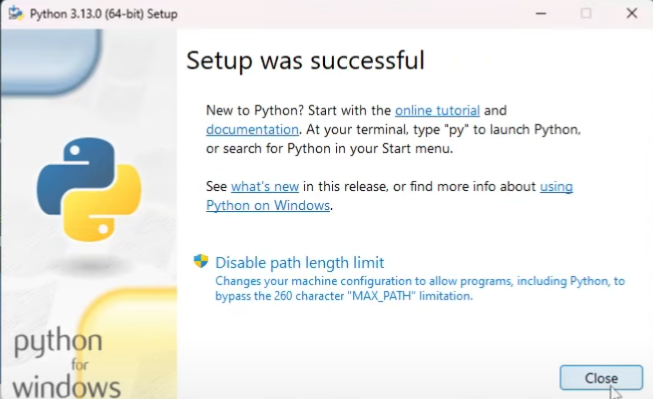

# Django TODO tutorial - Test Driven Development

## Tabla de contenidos

  - [About](#about)
  - [Conceptualización](#conceptualización)
    - [Qué es un Framework](#qué-es-un-framework)
    - [Utilidad de los frameworks](#utilidad-de-los-frameworks)
    - [Qué es Django](#qué-es-django)
    - [Qué es Test-Driven Development](#qué-es-test-driven-development)
    - [Por qué TDD](#por-qué-tdd)
  - [Paso 0: Instalación de Python](#paso-0-instalación-de-python)
  - [Paso 1: Creación del proyecto](#paso-1-creación-del-proyecto)
    - [Paso 1.1: Crear entorno virtual de Python](#paso-11-crear-entorno-virtual-de-python)
    - [Paso 1.2: Activar el entorno virtual](#paso-12-activar-el-entorno-virtual)
    - [Paso 1.3: Seleccionar Python Interpreter](#paso-13-seleccionar-python-interpreter)
    - [Paso 1.4: Instalar dependencias necesarias](#paso-14-instalar-dependencias-necesarias)
    - [Paso 1.5: Crear archivo `requirements.txt`](#paso-15-crear-archivo-requirementstxt)
    - [Paso 1.6: Crear proyecto Django](#paso-16-crear-proyecto-django)
  - [Paso 2: Entendimiento de los Archivos básicos de Django](#paso-2-entendimiento-de-los-archivos-básicos-de-django)
    - [Paso 2.1: `manage.py`](#paso-21-managepy)
    - [Paso 2.2: `settings.py`](#paso-22-settingspy)
    - [Paso 2.3: `urls.py`](#paso-23-urlspy)
    - [Paso 2.4: `wsgi.py` y `asgi.py`](#paso-24-wsgipy-y-asgipy)
  - [Paso 3: Creación de la Lógica básica del proyecto](#paso-3-creación-de-la-lógica-básica-del-proyecto)
    - [Paso 3.1: Crear aplicación](#paso-31-crear-aplicación)
    - [Paso 3.2: Agregar aplicación al proyecto](#paso-32-agregar-aplicación-al-proyecto)
    - [Paso 3.3: Incluir URLs de la aplicación en el proyecto](#paso-33-incluir-urls-de-la-aplicación-en-el-proyecto)
    - [Paso 3.4: Crear vista incial](#paso-34-crear-vista-incial)
    - [Paso 3.5: Crear la Home Page](#paso-35-crear-la-home-page)
    - [Paso 3.6: Crear la URL para la página principal](#paso-36-crear-la-url-para-la-página-principal)
    - [Paso 3.7: Crear modelo para Tareas](#paso-37-crear-modelo-para-tareas)
    - [Paso 3.8: Usar panel de administración](#paso-38-usar-panel-de-administración)
  - [Paso 4: Implementación de funcionalidades](#paso-4-implementación-de-funcionalidades)
    - [Paso 4.1: Funcionalidad para _"Creación de Tareas"_](#paso-41-funcionalidad-para-creación-de-tareas)
      - [Red: Implementación del test para _"Creación de Tareas"_](#red-implementación-del-test-para-creación-de-tareas)
      - [Green: Implementación de la funcionalidad para _"Creación de Tareas"_](#green-implementación-de-la-funcionalidad-para-creación-de-tareas)
      - [Refactor: Refactorización del código de la funcionalidad para _"Creación de Tareas"_](#refactor-refactorización-del-código-de-la-funcionalidad-para-creación-de-tareas)
    - [Paso 4.2: Funcionalidad para _"Ver lista de Tareas"_](#paso-42-funcionalidad-para-ver-lista-de-tareas)
      - [Red: Implementación del test para _"Ver lista de Tareas"_](#red-implementación-del-test-para-ver-lista-de-tareas)
      - [Green: Implementación de la funcionalidad para _"Ver lista de Tareas"_](#green-implementación-de-la-funcionalidad-para-ver-lista-de-tareas)
      - [Refactor: Refactorización del código de la funcionalidad para _"Ver lista de Tareas"_](#refactor-refactorización-del-código-de-la-funcionalidad-para-ver-lista-de-tareas)
    - [Paso 4.3: Funcionalidad para _"Editar Tarea"_](#paso-43-funcionalidad-para-editar-tarea)
      - [Red: Implementación del test para _"Editar Tarea"_](#red-implementación-del-test-para-editar-tarea)
      - [Green: Implementación de la funcionalidad para _"Editar Tarea"_](#green-implementación-de-la-funcionalidad-para-editar-tarea)
      - [Refactor: Refactorización del código de la funcionalidad para _"Editar Tarea"_](#refactor-refactorización-del-código-de-la-funcionalidad-para-editar-tarea)
    - [Paso 4.4: Funcionalidad para _"Eliminar Tarea"_](#paso-44-funcionalidad-para-eliminar-tarea)
      - [Red: Implementación del test para _"Eliminar Tarea"_](#red-implementación-del-test-para-eliminar-tarea)
      - [Green: Implementación de la funcionalidad para _"Eliminar Tarea"_](#green-implementación-de-la-funcionalidad-para-eliminar-tarea)
      - [Refactor: Refactorización del código de la funcionalidad para _"Eliminar Tarea"_](#refactor-refactorización-del-código-de-la-funcionalidad-para-eliminar-tarea)

---

## About

En este repo encontrarás un ejemplo básico de cómo construir una aplicación web, usando el framework de Python **Django**, para la gestión de tareas por hacer, usando la metodología Test-Driven Development.

En este documento _README_ podrás ver los pasos que debes seguir para construir la aplicación por tu cuenta. 

---

## Conceptualización

Seguramente ya sabes lo que es Python, y lo hasta puede que lo hayas usado en varios proyectos a largo de tu formación profesional. Sin embargo, puede que te preguntes qué es un **_framework_**, **_para qué sirve_**, y qué es **_Django_**. Además, puede que no tengas del todo claro **_qué es la metodología Test-Driven Development_** ni **_para qué sirve_**.


### Qué es un Framework

Para inciar, un **_framework_** puede verse como una caja de herramientas ya preparada para construir software. En lugar de empezar desde cero cada vez que quieres crear una aplicación, un **framework te da piezas listas** (estructuras, librerías, buenas prácticas) para que te concentres en lo importante: la lógica de tu aplicación.  

También, puedes entenderlo como una especie de **plantilla de trabajo**, que te dice cómo hacer u organizar ciertas partes de tus proyectos, y te otorga **utilidades** que facilitan las cosas enormemente.


### Utilidad de los frameworks

Por otro lado, los frameworks sirven para muchas cosas, como:

- **Estandarizar** la forma de hacer tus proyectos (ej. estructuras, procesos, etc.).
- **Ahorrarte esfuerzo**, pues suelen proveer código y funcionalidades ya hechas para tareas comunes (ej. autenticación, interacción con BD's, validación de estructuras de datos, etc.).
- **Evitar errores comunes** en proyectos (ej. SQL Injection, manejo de sesiones, etc.).

Estas ventajas no solo sirven para facilitarte la vida a la hora de desarrollar un proyecto, sino que proveen a tus aplicaciones de atributos de calidad, muy deseables en todo momento, como la escalabilidad o la mantenibilidad.


### Qué es Django

Por último, y debido a que este es el tema central de este tutorial, debes saber qué es **Django**.

Django es un **framework web de Python**. Esto significa que te proporciona unas bases sólidas con todo lo que necesitas para crear aplicaciones web (como páginas web, APIs, sistemas de información) de forma rápida, sencilla, segura y ordenada.

Es importante resaltar que Django es uno de los frameworks más conocidos y usados de Python. Es de código abierto (lo que significa que puedes ver su código y contribuir al [proyecto](https://github.com/django/django)), y se encuentra en funcionamiento desde julio de 2005.

Cuenta con una **estructura definida**, soporta el **Modelo Vista Controlador** (MVC) en su propia versión llamada **Modelo Template Vista** (MTV), cuenta con **ORM integrado**, incluye **protección contra ataques comunes** (XSS, CSRF, SQL Injection), y tiene varias funcionalidades dentro de sí (**panel de administración**, **autenticación**, **manejo de sesiones**, etc.).


### Qué es Test-Driven Development

**Test-Driven Development** o **Desarrollo Dirigido por Pruebas** (**TDD** por sus siglas en inglés) es una metodología de desarrollo de software en donde nos encargamos de desarrollar las pruebas del código (tests), antes de realizar la implementación de las funcionalidades per se.

TDD se basa en un **ciclo llamado Red-Green-Refactor**, donde:

- **Red**

    Se **escribe una prueba que falla** porque aún no se ha implementado el código necesario para que esta pase. 

    Le debe su nombre al color que aparecerá en tu consola cuando ejecutes la prueba y esta falle: **rojo**. 

    Ej:
    
    Supón que estás en el inicio de este proyecto, quieres realizar una funcionalidad para encontrar una tarea por su `id`, y el nombre de la función será `get_task(task_id)`. En este caso, debes crear un test que pruebe que al ejecutar `get_task(1)` te devuelva la tarea cuyo `id` es 1.

    La primera vez que ejecutes dicho test, dado que aún no existe esa función, obtendrás algo como:

    

    > **Nota:** Esta es, únicamente, una imagen de referencia. Es probable que en Django no se vean igual los tests fallidos (depende de la test suite que uses).

- **Green**

    Se **escribe el mínimo código necesario** para que la prueba pase exitosamente.

    Esta fase del ciclo le debe su nombre, igual que la anterior, al color que verás en tu consola cuando vuelvas a ejecutar la prueba y esta pase: **verde**.

    Ej:

    Implementas la función:

    ```python
    def get_task(task_id):
        return db.find(task_id)
    ```

    Ahora deberías obtener algo como:

    

    > **Nota:** Esta es, únicamente, una imagen de referencia. Es probable que en Django no se vean igual los tests exitosos (depende de la test suite que uses).


- **Refactor**

    Se **mejora el código**, sin cambiar su comportamiento, para que siga las mejores prácticas y pase de ser un código básico o feo, a ser un **buen código**.

    Ej:

    Limpias redundancias, eliminas malas prácticas, optimizas ciclos, etc.

    > **Nota**: Es probable que haya funcionalidades demasiado básicas que no precisen de una refactorización. En ese caso, no te alarmes. Solo ten en cuenta que necesitarás esta fase para otras funcionalidades. 


### Por qué TDD

Puede que te preguntes: _"¿Por qué debería escribir pruebas antes de programar?"_

La respuesta corta es: **porque TDD te ayuda a pensar mejor en lo que quieres construir y a escribir un código más confiable**.

Algunas razones para usar TDD son:

- **Claridad en los requisitos**

    Antes de escribir código, debes pensar en qué debería hacer tu función o módulo. Eso obliga a entender mejor el problema antes de lanzarte a programar.

- **Menos errores en producción**

    Al tener pruebas desde el inicio, evitas que cambios futuros rompan funcionalidades que ya tenías listas. Los tests actúan como una red de seguridad.

- **Código más simple y mantenible**

    Como el objetivo es hacer pasar la prueba con el mínimo código posible, se evita la tentación de escribir de más. Luego, en la fase de _Refactor_, mejoras el diseño sin miedo a dañar nada.

- **Documentación viva**

    Las pruebas son ejemplos ejecutables de cómo debe funcionar tu aplicación. Si alguien nuevo llega al proyecto, puede entender rápidamente qué hace el sistema revisando los tests.

- **Confianza para refactorizar o agregar nuevas funcionalidades**

    Puedes modificar tu código con la tranquilidad de que, si algo se rompe, los tests lo mostrarán de inmediato.

En resumen, **TDD no solo es escribir pruebas por escribir**, sino una manera de **construir software de forma más segura, ordenada y con calidad profesional**.

---

## Paso 0: Instalación de Python

Antes de que te pongas manos a la obra con el proyecto, debes tener instalado el lenguaje de programación sobre el que funciona Django: Python. 

Esto es imprescindible para poder crear y ejecutar el proyecto.

Antes que nada, debes verificar si ya tienes instalado el lenguaje. Para ello, abre una terminal y ejecuta el siguiente comando:

```bash
python --version
```

Si ya lo tienes instalado, obtendrás un resultado como este:

```bash
Python 3.x.x
```

> **Nota**: Si Python ya está instalado en tu dispositivo, puedes saltarte todo este paso de instalación e ir al [siguiente](#creación-del-proyecto).

Si no obtienes algo así, significa que debes instalar Python. Para hacerlo:

- Dirígete a la sección de instalación del lenguaje (en su [página oficial](https://www.python.org)) correspondiente al Sistema Operativo que estés usando:

    - [Windows](https://www.python.org/downloads/windows)
    - [Linux/Unix](https://www.python.org/downloads/source)
    - [macOS](https://www.python.org/downloads/macos)

- Descarga el instalador de la versión que prefieras.

    Por lo general, es recomendable usar la versión estable más actual, pero eso dependerá de tus necesidades personales y profesionales. 

    > **Nota**: Siempre puedes tener varias versiones de Python en el mismo dispositivo y usar la que más te convenga en cada momento.

- Ejecuta el instalador descargado.

    El instalador, como su nombre lo dice, instalará el lenguaje en tu dispositivo. Al ejecutarlo, se iniciará el proceso con esta ventana:

    

    > **Nota**: La casilla **"Add python.exe to PATH"** debes marcarla SOLO si no tenías Python instalado antes. En caso de que estés instalado una versión distinta a la que tienes actualmente, asegúrate de dejarla sin marcar. En caso de que no lo tuvieras instalado antes, es muy importante que la marques.

    Después de eso, presiona donde dice **"Install Now"**. Eso te mostrará algo así:

    

    Al terminar, verás:

    


Con esto ya tendrías Python instalado. Puedes verificarlo abriendo una nueva terminal y ejecutando:

```bash
python --version
```

---
---

## Paso 1: Creación del proyecto

Para inicializar el proyecto deberás seguir estos pasos:

---

### Paso 1.1: Crear entorno virtual de Python

Crear un entorno virtual en Python te permite trabajar en un ambiente aislado, gestionando de manera independiente las dependencias de cada proyecto. Esto evita conflictos entre versiones de librerías y garantiza un entorno más ordenado y controlado.

Usa este comando para crearlo:

```bash
python -m venv venv
```

> **Nota:** El entorno puede tener el nombre que desees. En este caso, uso `venv` por convención. Además, es necesario que crees el entorno en la carpeta raíz del proyecto.

---

### Paso 1.2: Activar el entorno virtual

Una vez creado el entorno virtual, es preciso activarlo dentro de la consola que usarás para manejar y ejecutar tu proyecto. 

Usa este comando para activarlo:

```bash
./venv/Scripts/activate
```

> **Nota:** Reemplaza `venv` con el nombre que hayas escogido para tu entorno.

---

### Paso 1.3: Seleccionar Python Interpreter

Una vez creado, y activado, el entorno virtual, es importante asegurarse de que tu editor o IDE utilice el intérprete correcto. Esto garantiza que las dependencias instaladas en el entorno virtual sean reconocidas y usadas en tu proyecto.

En Visual Studio Code (VS Code) debes hacer lo siguiente:

- Abrir el **Command Palette** presionando `Ctrl + Shift + P`.
- Escribir "Python: Select Interpreter" y presionar `Enter`.
- Buscar el intérprete correspondiente al entorno creado. Suele estar marcado con la palabra `Recommended`.
- Seleccionar el intérprete.

---

### Paso 1.4: Instalar dependencias necesarias

Ahora que tu entorno está preparado, deberás instalar las dependencias necesarias para usar Django.

Ve a la consola, en VSCode puedes hacer presionando `Ctrl + J`, y ejecuta:

```bash
pip install django
```

> **Nota:** Asegúrate de ejecutar este comando en la consola donde el entorno virtual esté activado. En VS Code, puedes verificarlo al inicio de cada línea de la terminal, donde debería aparecer el nombre del entorno entre paréntesis, por ejemplo: `(venv) PS E:\WORKSPACE (PC)\django-todo-tutorial>`.

Ahora puedes verificar la versión instalada de Django usando el comando:

```bash
django-admin --version
```

---

### Paso 1.5: Crear archivo `requirements.txt`

El archivo [`requirements.txt`](requirements.txt) es una lista de todas las dependencias de tu proyecto. Guardar esta lista permite que otras personas (o tú mismo en otro momento) puedan instalar fácilmente las mismas versiones de las librerías necesarias. Es importante destacar que el entorno virtual, donde se instalan estas dependencias, **no debería** subirse al repositorio o sistema de control de versiones, por lo que este archivo es clave para reproducir el entorno de trabajo correctamente.

Para generarlo:

```bash
pip freeze > requirements.txt
```

> **Nota:** Este comando creará un archivo con el nombre `requirements.txt`, en caso de que no exista, con los nombres de las librerías que tengas instaladas en tu entorno virtual. En caso de que el archivo ya exista, agregará las nuevas librerías que no estén listadas en dicho archivo. 

> **Importante:** Ejecutar este comando cada vez que hagas la instalación de nuevas librerías para mantener el archivo de requerimentos actualizado.

Para instalar las dependencias desde el archivo (en otra máquina, por ejemplo):

```bash
pip install -r requirements.txt
```

---

### Paso 1.6: Crear proyecto Django

Hasta este punto, todo lo que has hecho es preparar tu entorno de desarrollo. Sin embargo, es necesario que crees tu proyecto de Django, donde estará todo el código de tu aplicación.

Para crearlo, ejecuta:

```bash
django-admin startproject todo_app .
```

> **Nota:** En este caso, el nombre del proyecto es `todo_app`. Sin embargo, puedes nombrarlo como desees, dependiendo de su propósito y funcionalidad.

Ahora, puedes ejecutar tu proyecto para verificar que todo esté bien:

```bash
python manage.py runserver
```

> **Nota:** Al ejecutar este comando, verás información relevante sobre tu proyecto, incluyendo la URL local para acceder a él (generalmente `http://127.0.0.1:8000/`). Es normal que, al correr el proyecto por primera vez, la consola muestre texto en rojo indicando que hay migraciones pendientes. No te preocupes, esto solo significa que debes aplicarlas antes de continuar (lo verás más adelante en el tutorial).

Al abrir la URL, deberías ver algo así:


---
---

## Paso 2: Entendimiento de los Archivos básicos de Django

Al crear un proyecto en Django, se genera una estructura de archivos que permite su correcto funcionamiento. A continuación, te explico el propósito de cada uno:

---

### Paso 2.1: [`manage.py`](manage.py)

Este archivo es el punto de entrada para interactuar con el proyecto desde la línea de comandos. Permite ejecutar comandos clave como iniciar el servidor, aplicar migraciones y crear aplicaciones.

De hecho, ya lo usaste, en el último paso de la sección anterior, para ejecutar el proyecto.

---

### Paso 2.2: [`settings.py`](todo_app/settings.py)

Este archivo contiene la configuración principal del proyecto Django. Aquí se definen aspectos clave como la base de datos, las aplicaciones instaladas, la configuración de seguridad y los archivos estáticos.

Algunas de las principales configuraciones que se pueden establecer en este archivo son:

- `INSTALLED_APPS`: Lista de aplicaciones activas en el proyecto (lo verás más adelante).
- `DATABASES`: Configuración de la base de datos del proyecto. Por defecto, Django crea y configura una de SQLite, llamada `db.sqlite3`, pero puedes cambiarlo para que use la que prefieras (incluso NoSQL).
- `MIDDLEWARE`: Conjunto de procesos que se ejecutan en cada petición antes de llegar a la vista.
- `TEMPLATES`: Configuración para los archivos HTML del proyecto.
- `STATIC_URL`: Ruta para archivos estáticos como CSS, JavaScript e imágenes.

Al cambiar este archivo, cambias la configuración del proyecto. Por ejemplo, puedes configurar una BD distinta:

```python
DATABASES = {
    'default': {
        'ENGINE': 'django.db.backends.postgresql',
        'NAME': 'mi_base_de_datos',
        'USER': 'mi_usuario',
        'PASSWORD': 'mi_contraseña',
        'HOST': 'localhost',
        'PORT': '5432',
    }
}
```

---

### Paso 2.3: [`urls.py`](todo_app/urls.py)

En este archivo se definen las rutas del proyecto. Básicamente, se define la vista que se debe ejecutar cuando se acceda a cada URL dentro de la aplicación.

Incialmente, este archivo contiene la ruta al panel de administración: `/admin/`. Las nuevas rutas se deben agregar a la lista `urlpatterns`.

---

### Paso 2.4: `wsgi.py` y `asgi.py`

Estos archivos son puntos de entrada para que servidores web ejecuten el proyecto Django.

[`wsgi.py`](todo_app/wsgi.py) (Web Server Gateway Interface): Es el archivo que Django usa por defecto para desplegar el proyecto en servidores tradicionales, como Apache o Gunicorn. Se usa en despliegues con WSGI-compatible, ideal para la mayoría de aplicaciones estándar.

[`asgi.py`](todo_app/asgi.py) (Asynchronous Server Gateway Interface): Permite manejar peticiones asíncronas, mejorando el rendimiento en aplicaciones que requieren WebSockets o tareas en tiempo real. Está pensado para servidores como Daphne y Uvicorn.

---
---

## Paso 3: Creación de la Lógica básica del proyecto

---

### Paso 3.1: Crear aplicación

En Django, los proyectos se estructuran en módulos llamados aplicaciones. Cada aplicación gestiona una parte específica de la lógica del proyecto y, en muchos casos, puede reutilizarse en otros proyectos si es necesario.

Django, por defecto, incluye varias aplicaciones que manejan funcionalidades básicas del proyecto. Puedes ver la lista de aplicaciones activas en el archivo [`settings.py`](todo_app/settings.py), dentro de la variable `INSTALLED_APPS`.

Para crear una aplicación, debes ejecutar:

```bash
python manage.py startapp tasks
```

> **Nota:** Este comando creará una [carpeta](tasks/) con el nombre de la app (`tasks` en este caso). Puedes darle el nombre que desees a cada app.

Cada aplicación del proyecto tiene una estructura de archivos propia, que le permiten manejar la lógica de forma modular:

- [`admin.py`](tasks/admin.py): Sirve para registrar modelos en el panel de administración de Django, permitiendo gestionarlos desde esta interfaz.
- [`apps.py`](tasks/apps.py): Contiene la configuración de la aplicación. Django lo usa para registrar la aplicación dentro del proyecto.
- [`migrations/`](tasks/migrations/): Es donde se guardan los archivos de migraciones que Django usa para gestionar la base de datos. Cada vez que modificas un modelo y ejecutas el comando `makemigrations`, Django genera un nuevo archivo dentro de esta carpeta.
- [`models.py`](tasks/models.py): Define las estructuras de datos de la aplicación mediante modelos de Django. Los modelos representan las tablas de la base de datos.
- [`tests.py`](tasks/tests.py): Contiene pruebas automatizadas para verificar el correcto funcionamiento de la aplicación.
- [`views.py`](tasks/views.py): Contiene la lógica de negocio de la aplicación. Es donde se definen las vistas, que son funciones o clases que procesan solicitudes y devuelven respuestas.
- [`urls.py`](tasks/urls.py): No se crea por defecto, pero es recomendable crearlo y usarlo para cada aplicación. Tiene la misma función que el `urls.py` general.

---

### Paso 3.2: Agregar aplicación al proyecto

Una vez que has creado una aplicación, es necesario registrarla en la configuración del proyecto para que Django la reconozca y pueda utilizarla.

Para agregarla, debes:

- Ir al archivo de configuración [`settings.py`](todo_app/settings.py).
- Buscar la lista llamada `INSTALLED_APPS`.
- Agregar un elemento con el nombre de la app que quieres registrar. En este caso sería `'tasks'`.

---

### Paso 3.3: Incluir URLs de la aplicación en el proyecto

Cuando cada aplicación maneja sus propias rutas en su propio archivo `urls.py`, es necesario incluirlas en el archivo de URLs principal del proyecto para que Django las reconozca.

Para hacer esto, debes:

- Ir al [archivo de URLs principal](todo_app/urls.py).

- Importar la función `include`:

    ```python
    from django.urls import path, include
    ```

- Agregar un elemento a la lista `urlpatterns`, usando la función `include()`, de la siguiente manera:

    ```python
    path('', include('tasks.urls')),
    ```

---

### Paso 3.4: Crear vista incial

Ahora debes crear una función que se encargue de mostrar la página inicial (home page) de tu aplicación.

Para ello, ve al [`views.py`](tasks/views.py) y crea la siguiente función:

```python
def home(request):
    return render(request, 'home.html')
```

Esta función se encargará de renderizar el archivo `home.html`, que deberás crear en un momento, cuando sea llamada.

---

### Paso 3.5: Crear la Home Page

Ya creaste una función que se encarga de mostrar la página inicial. Ahora, debes diseñar esta página creando una plantilla HTML.

Para esto, deberás:

- Dentro de la carpeta de la aplicación ([`tasks/`](tasks/)), crea una nueva carpeta llamada `templates/`.

- Dentro de `templates/`, crea un archivo llamado `base.html`.

- Agrega el siguiente código a [`base.html`](tasks/templates/base.html):

    ```html
    <!DOCTYPE html>
    <html lang="en">
        <head>
            

            <meta charset="UTF-8"/>
            <meta http-equiv="X-UA-Compatible" content="IE-edge" />
            <meta name="viewport" content="width=device-width, initial-scale=1.0" />

            <title>TO DO APP</title>

            <link rel="stylesheet" href="https://cdn.jsdelivr.net/npm/bootstrap@5.3.2/dist/css/bootstrap.min.css"/>

            <!-- <script src=""></script> -->
            <!-- jQuery, Popper.js, y Bootstrap JS -->
            <script src="https://code.jquery.com/jquery-3.6.0.min.js"></script>
            <script src="https://cdn.jsdelivr.net/npm/bootstrap@5.3.2/dist/js/bootstrap.bundle.min.js"></script>

            <style>
                .sidebar {
                    height: 100vh;
                    width: 250px;
                    position: fixed;
                    top: 0;
                    left: 0;
                    background: #343a40;
                    padding-top: 20px;
                }
                .sidebar a {
                    color: white;
                    display: block;
                    padding: 10px;
                    text-decoration: none;
                }
                .sidebar a:hover {
                    background: #495057;
                }
                .content {
                    margin-left: 260px;
                    padding: 20px;
                }
            </style>
        </head>

        <body>
            <div class="sidebar">
                <h4 class="text-white text-center">To-Do App</h4>
                <a href="">Ver Tareas</a>
                <a href="">Crear Tarea</a>
            </div>
        
            <div class="content">
                
                
            </div>
        </body>
    </html>
    ```

- Dentro de `templates/`, crea un archivo llamado `home.html`.

- Agrega el siguiente código a [`home.html`](tasks/templates/home.html):

    ```html
    

    


    <!DOCTYPE html>
    <html lang="es">
    <head>
        <meta charset="UTF-8">
        <meta name="viewport" content="width=device-width, initial-scale=1.0">
        <title>TO DO APP</title>
        
        <style>
            body {
                font-family: Arial, sans-serif;
                display: flex;
                justify-content: center;
                align-items: center;
                height: 100vh;
                margin: 0;
                background-color: #f4f4f4;
            }
            h1 {
                color: #333;
            }
        </style>
    </head>
    <body>
        <div class="d-flex justify-content-center">
            <h1>Aplicación To-Do</h1>
        </div>
    </body>
    </html>

    
    ```

    > **Nota:** Puedes personalizar el diseño de la página agregando CSS, o usando bibliotecas de diseño como Bootstrap.

---

### Paso 3.6: Crear la URL para la página principal

Ya tienes la vista y la plantilla de la página principal. Ahora debes configurar una URL para que puedas acceder a ella desde el navegador.

Para ello:

- Dirígete al [archivo de rutas](tasks/urls.py) de la aplicación (`tasks`).

- Agrega el siguiente código:

    ```python
    from django.urls import path
    from . import views

    urlpatterns = [
        path('', views.home, name='home'),
    ]
    ```

En este código, `path('', views.home, name='home')` define la URL raíz (`''`), que apunta a la vista home. De esta forma, se mostrará la Home Page cuando se acceda a la ruta raíz.

Ahora ejecuta el proyecto, como lo hiciste antes, y asegúrate de que esté funcionando. Pero, antes, modifica las siguientes líneas del `base.html` que acabas de crear:

```html
<a href="">Ver Tareas</a>
<a href="">Crear Tarea</a>
```

para dejarlas así:

```html
<a href="">Ver Tareas</a>
<a href="">Crear Tarea</a>
```

Debes hacer esto porque se está haciendo referencia a rutas que aún no existen por lo que, si ejecutas el proyecto, te saldrá un error. **No olvides** volver a agregar estas referencias cuando las hayas creado, para que los botones te lleven a las pantallas apropiadas al clicarlos.

Deberías ver algo así:


---

### Paso 3.7: Crear modelo para Tareas

En este momento, tienes la base del proyecto. Ahora es momento de hacer la lógica del negocio de forma que no solo muestre un saludo de bienvenida, sino que puedas crear, actualizar y eliminar tus tareas.

Para esto:

- Ve al archivo [`models.py`](tasks/models.py).

- Crea los modelos que representarán las tareas y estados en la Base de Datos.

    Modelo para representar el **estado** de una tarea:

    ```python
    class Status(models.Model):
        id = models.AutoField(
            primary_key=True,
            null=False,
            blank=False,
        )

        name = models.CharField(
            max_length=100,
            unique=True,
            null=False,
            blank=False,
        )

        def __str__(self):
            return self.name
    ```

    Modelo para representar las **tareas**:

    ```python
    class Task(models.Model):
        id = models.AutoField(
            primary_key=True,
            null=False,
            blank=False,
        )

        name = models.CharField(
            max_length=100,
            null=False,
            blank=False,
        )

        description = models.TextField(
            null=True,
            blank=True,
        )
        
        created_at = models.DateTimeField(
            auto_now_add=True,
            null=False,
            blank=False,
        )

        updated_at = models.DateTimeField(
            auto_now=True,
            null=False,
            blank=False,
        )
        
        deadline = models.DateTimeField(
            null=True,
            blank=True,
        )

        status_id = models.ForeignKey(
            Status,
            on_delete=models.CASCADE,
            null=False,
            blank=False,
        )

        def __str__(self):
            return self.name
    ```

- Ejecuta las migraciones para sincronizar los cambios en los modelos con la BD: 

    ```bash
    python manage.py makemigrations
    ```

    > **Nota:** Con este comando, creas las migraciones de los cambios que hayas hecho en los modelos. Eso significa que se crearán archivos para representarlas dentro de la carpeta `migrations/`.

    ```bash
    python manage.py migrate
    ```

    > **Nota:** Con este comando haces que los cambios que registraste, con el comando anterior, se sincronicen. Es necesario ejecutar ambos comandos para que los cambios surtan efecto.

Una vez que hayas creado los modelos, y hayas ejecutado las migraciones, podrás revisar la BD que estés usando, y verás cómo se han creado las tablas para representarlos:

- Tabla `status`:

    

- Tabla `tasks`:
    
    

Hecho esto, solo te falta agregar tus modelos al panel de administración. Para esto:

- Ve a [`admin.py`](tasks/admin.py).

- Importa tus modelos:

    ```python
    from .models import Status, Task
    ```

- Registra tus modelos:

    ```python
    admin.site.register(Status)
    admin.site.register(Task)
    ```

---

### Paso 3.8: Usar panel de administración

Ahora que ya tienes tus modelos de datos listos para la acción, puedes hacer uso del panel de administración que viene por defecto en Django.

Este panel es una interfaz web automática que permite gestionar los datos del proyecto sin necesidad de escribir código SQL. En este, puedes crear, editar y eliminar registros en la base de datos, administrar usuarios y permisos, y visualizar modelos de forma estructurada.

Para usarlo, debes crear un súper-usuario:

```bash
python manage.py createsuperuser
```

> **Nota:** Al ejecutar este comando, se te pedirá, por consola, una serie de datos que se usarán para la creación del super-usuario. Asegúrate de no olvidarlos.


Una vez que has creado el usuario, puedes dirgirte al panel de administración. Para ello, simplemente ejecuta el proyecto y dirígete a la ruta `/admin` (por ejemplo: `http://localhost:8000/admin/`). Allí, verás una página de inicio de sesión:


Al iniciar sesión, verás los modelos que Django incluye por defecto, y los que acabas de crear:


Explora este panel de administración y crea los estados en los que quieras que sea posible poner tus tareas.

---
---

## Paso 4: Implementación de funcionalidades

Ya cuentas con lo básico que necesitarás para el desarrollo del proyecto. Por ende, es momento de iniciar con el desarrollo de las funcionalidades que tendrá esta aplicación:

---

### Paso 4.1: Funcionalidad para _"Creación de Tareas"_

La idea de esta funcionalidad es que puedas crear nuevas tareas desde la interfaz de tu propia aplicación, en lugar de tener que hacerlo desde el panel de administrador.

Como estamos **trabajando con la metodología TDD**, vamos a **seguir el ciclo Red-Green-Refactor** del que te hablé al incio del tutorial:


#### Red: Implementación del test para _"Creación de Tareas"_

Seguro recuerdas que esta fase del ciclo es donde debes crear el test para la funcionalidad que quieres implementar (_"Creación de Tareas"_ en este caso). Para este propósito, debes:

- **Dirígete al archivo de pruebas del módulo `tasks`: [`tests.py`](tasks/tests.py)**

    Este archivo te servirá para almacenar las pruebas unitarias de las funcionalidades del proyecto. Inicialmente, verás algo así:

    ```python
    from django.test import TestCase

    # Create your tests here.
    ```

    `TestCase` es la clase de Django más usada para la realización de pruebas unitarias. Por supuesto que podrías usar otras opciones como `pytest` o `unittest`, pero es mejor que uses `django.test.TestCase` en los proyectos de Django.

- **Importar los modelos `Task` y `Status`**
    
    Para poder probar la funcionalidad de _"Creación de Tareas"_ debes importar los modelos de datos [`Task` y `Status`](tasks/models.py) que creaste para la interacción con la base de datos.

    Escribe lo siguiente en el archivo [`tests.py`](tasks/tests.py):

    ```python
    from .models import Task, Status
    ```

    Además de los modelos, hay un par de clases extra que debes importar para poder hacer tu test de forma correcta:

    ```python
    import datetime
    from django.urls import reverse
    from django.utils import timezone
    ```

- **Crear el caso de prueba**

    Ahora sí puedes crear el test o caso de prueba:

    ```python
    class CreateTaskViewTest(TestCase):
        """
        Test cases for create_task view.
        """

        def setUp(self):
            self.status = Status.objects.create(name="Pendiente")

        def test_create_task(self):
            """
            Test the create_task endpoint.
            """

            response = self.client.post(reverse("create-task"), {
                "task-name": "Aprender TDD",
                "task-description": "Seguir el tutorial paso a paso",
                "task-deadline": "2025-09-15",
            })

            # Verificamos que la tarea se haya guardado en la BD con la información correcta
            task = Task.objects.first()
            self.assertIsNotNone(task)
            self.assertEqual(task.name, "Aprender TDD")
            self.assertEqual(task.description, "Seguir el tutorial paso a paso")

            expected_date = timezone.make_aware(datetime.datetime(2025, 9, 15))
            self.assertEqual(task.deadline, expected_date)
            self.assertEqual(task.status_id, self.status)
    ```

    Acá es importante que sepas que `setUp(self)` se ejecuta siempre que ejecutes las pruebas unitarias, y se usa para que establezcas el escenario incial que deseas en tus casos de prueba.

    Además, el nombre de cada caso de prueba debe iniciar, obligatoriamente, con `test_`. Esto es así porque es la manera que usa Django para identificar que esa función se trata de un test.

Muy bien, pues ya has creado tu test para probar la funcionalidad de _"Creación de Tareas"_. Ahora puedes ejecutarlo para que veas lo que sucede si aún no has implementado dicha funcionalidad:

```bash
python manage.py test
```

Después de eso, verás que **fallará** con algo como:


> **Nota:** Si lo deseas, puedes crear más tests que prueben otras situaciones (como cuando se asigna un deadline inválido, o cuando no se le pasa algún parámetro, por ejemplo).


#### Green: Implementación de la funcionalidad para _"Creación de Tareas"_

Ya que has creado tus tests, puedes pasar a la acción: Implementar la funcionalidad. El proceso para hacer esto es, esencialmente, el mismo que seguiste para poder renderizar la pantalla principal: 1) crear una vista que se encargue de procesar las solicitudes y devolver las respuestas, 2) crear el archivo HTML con el contenido que se renderizará, y 3) registrar la URL con la que se podrá acceder a la nueva pantalla.

De hecho, estos son los 3 pasos que tendrás que realizar para cada nueva pantalla que desees agregar.

- **Crear vista**:

    Ve a [`views.py`](tasks/views.py) y define la vista con la que se renderizará la pantalla de creación de tareas:
    
    ```python
    def create_task(request):
        if request.method == 'POST':
            name: str = request.POST.get('task-name', '')
            description: str = request.POST.get('task-description', '').strip()
            status_id: Status = Status.objects.get(name='Pendiente')

            deadline_str: str = request.POST.get('task-deadline', '').strip()
            deadline: datetime.datetime = None

            if deadline_str:
                try:
                    deadline = datetime.datetime.strptime(deadline_str, '%Y-%m-%d')

                except ValueError:
                    pass

            Task.objects.create(
                name=name,
                description=description,
                deadline=deadline,
                status_id=status_id,
            )

            messages.success(request, '¡Tarea creada exitosamente!')

            return redirect('list-tasks')

        return render(request, 'create_task.html')
    ```

    En la vista anterior hay varios elementos nuevos que no están importados aún, por lo que se te marcarán como errores. Para solucionarlo, modifica los `imports` para que queden así:

    ```python
    import datetime
    from django.shortcuts import render, redirect
    from django.contrib import messages
    from django.utils import timezone
    from tasks.models import Task, Status
    ```

    Esta vista hace dos cosas distintas. En primer lugar, **si la petición que le está llegando es del método GET (el que usa el navegador cuando accedes a una URL) simplemente renderiza la pantalla de creación de tareas**. Por otro lado, **si la petición que recibe es con el método POST (que será el que llegará cuando se haga click en el botón de `Crear Tarea`) se encargará de extraer los datos de la tarea y crearla dentro de la BD**.

- **Crear la pantalla HTML**:

    Para que la vista que creaste pueda mostrar algo, es necesario crear el template HTML. Para esto, ve a la [carpeta que contiene los templates](tasks/templates/) y crea un archivo con el nombre `create_task.html`.

    Dentro de este archivo, pon el código:

    ```html
    

    
    <!DOCTYPE html>
    <html lang="es">
    <head>
        <title>Crear Tarea</title>
    </head>
    <body class="bg-light">

        <div class="container mt-5">
            <h2 class="mb-4">Crear Nueva Tarea</h2>

            <div class="card shadow-sm">
                <div class="card-body">
                    <form method="POST" action="">
                        
                        
                        <div class="mb-3">
                            <label for="task-name" class="form-label">Nombre de la Tarea</label>
                            <input type="text" class="form-control" id="task-name" name="task-name" required>
                        </div>

                        <div class="mb-3">
                            <label for="task-description" class="form-label">Descripción</label>
                            <textarea class="form-control" id="task-description" name="task-description" rows="3"></textarea>
                        </div>

                        <div class="mb-3">
                            <label for="task-deadline" class="form-label">Fecha Límite</label>
                            <input type="date" class="form-control" id="task-deadline" name="task-deadline">
                        </div>

                        <button type="submit" class="btn btn-primary">Crear Tarea</button>
                        <a href="" class="btn btn-secondary">Cancelar</a>
                    </form>
                </div>
            </div>
        </div>

    </body>
    </html>

    
    ```

- **Registrar URL**:

    Ahora debes registrar la URL para poder acceder a la pantalla de creación de tareas. Para esto, ve al archivo de [URLs](tasks/urls.py) y agrega la ruta así:

    ```python
    path('create-task/', views.create_task, name='create-task'),
    ```

Tu página ya puede crear nuevas tareas en la base de datos. Sin embargo, el código tiene referencias a URLs que aún no existen (las que se usarán para los servicios que aún no has creado) por lo que obtendrás un error si tratas de ejecutarlo. Puntualmente, esta funcionalidad redirecciona a una página que lista todas las tareas existentes en:

```python
return redirect('list-tasks')
```

Si deseas probarlo ahora, solo cambia esa referencia por:

```python
return redirect('home')
```

Ahora puedes volver a probar a ejecutar tus pruebas:

```bash
python manage.py test
```

Esta vez, deberían pasar exitosamente con algo así:


> **Nota:** **NO OLVIDES** volverlo a cambiar por `return redirect('list-tasks')` cuando termines de hacer la prueba. 


#### Refactor: Refactorización del código de la funcionalidad para _"Creación de Tareas"_

Ya es hora de pasar a la última fase del ciclo de TDD. En esta fase, debemos procurar mejorar el código, sin cambiar su funcionamiento.

En la funcionalidad anterior hay varias cosas que podemos mejorar.

Ej: **Aislar lógica de parsing del deadline**:

Para mejorar el código, podemos manejar la lógica de transformación del deadline en una función aparte. Para ello, crea este método:

```python
def parse_deadline(deadline_str: str) -> datetime.datetime | None:
    """
    Converts a string YYYY-MM-DD into a datetime object, or None if it's invalid.
    """

    if not deadline_str:
        return None
    try:
        deadline = datetime.datetime.strptime(deadline_str.strip(), "%Y-%m-%d")
        deadline = timezone.make_aware(deadline) # Evita el warning de time zone
        
        return deadline
    except ValueError:
        return None
```

Y modifica la función `create_task()` para que quede así:

```python
def create_task(request):
    """
    Create a new task or render the creation form.
    """
    
    if request.method == 'POST':
        name: str = request.POST.get('task-name', '')
        description: str = request.POST.get('task-description', '').strip()
        status_id: Status = Status.objects.get(name='Pendiente')

        deadline_str: str = request.POST.get('task-deadline', '').strip()
        deadline: datetime.datetime = parse_deadline(deadline_str)

        Task.objects.create(
            name=name,
            description=description,
            deadline=deadline,
            status_id=status_id,
        )

        messages.success(request, '¡Tarea creada exitosamente!')

        return redirect('list-tasks')

    return render(request, 'create_task.html')
```

Ahora podemos **volver a probar** que las pruebas sigan funcionando correctamente (usando `return redirect('home')` para evitar tratar de llamar a un servicio que aún no existe):


El anterior es solo un ejemplo de un aspecto a mejorar en la fase de refactor. Te animo a buscar más y llevarlas a cabo.

---

### Paso 4.2: Funcionalidad para _"Ver lista de Tareas"_

La idea de esta funcionalidad es que puedas ver una lista de todas las tareas que hay creadas hasta el momento, para que sepas qué es lo que tienes pendiente por hacer.

Con esta funcionalidad, y todas las demás, seguiremos el mismo proceso de la anterior: el ciclo Red-Green-Refactor sobre el que se basa la metodología TDD.


#### Red: Implementación del test para _"Ver lista de Tareas"_

Vamos a crear el test para la funcionalidad _"Ver lista de Tareas"_. Nuevamente, vamos a hacerlo dentro de [`tests.py`](tasks/tests.py).

Debajo de todo lo hicimos en el paso anterior, crea un nuevo `TestCase` para la nueva funcionalidad así:

```python
class ListTasksViewTest(TestCase):
    """
    Test cases for list_tasks view.
    """

    def setUp(self):
        self.status = Status.objects.create(name="Pendiente")

    def test_list_tasks(self):
        """
        Test the list_tasks endpoint.
        """

        # Crear una tarea para listar
        Task.objects.create(
            name="Aprender TDD",
            description="Seguir el tutorial paso a paso",
            deadline=timezone.make_aware(datetime.datetime(2025, 9, 15)),
            status_id=self.status,
        )

        response = self.client.get(reverse("list-tasks"))
        self.assertEqual(response.status_code, 200)
        self.assertTemplateUsed(response, "list_tasks.html")

        # Verificamos que la tarea se muestre en la lista
        self.assertContains(response, "Aprender TDD")
        self.assertContains(response, "Seguir el tutorial paso a paso")
```

Este test se encarga de crear una tarea para mostrar en el listado, y después verifica que la funcionalidad responda bien, que use la plantilla HTML correcta, y que muestre la información de la tarea creada.

Puedes ejecutar las pruebas para que veas lo que sucede ahora que tienes más de un test:

```bash
python manage.py test
```


En tu resultado verás que se detectaron y ejecutaron 2 tests (`Found 2 test(s).` y `Ran 2 tests in 0.025s`), y que uno de ellos falló (`FAILED (errors=1)`). El test que falló fue este que acabas de crear.

> **Nota:** Nuevamente, te insto a que pienses en otras situaciones posibles, y crees más tests.


#### Green: Implementación de la funcionalidad para _"Ver lista de Tareas"_

Ahora tienes que crear la funcionalidad para que tus tests pasen exitosamente. Para ello, debes **repetir los mismos pasos que seguiste en la fase [Green: Implementación de la funcionalidad para _"Creación de Tareas"_](#green-implementación-de-la-funcionalidad-para-creación-de-tareas)**.

- **Crear vista**:

    Ve a [`views.py`](tasks/views.py) y define la vista con la que se renderizará la pantalla de listado de tareas:

    ```python
    def list_tasks(request):
        return render(request, 'list_tasks.html', {
            'tasks': Task.objects.all(),
        })
    ```

- **Crear la pantalla HTML**:

    Ve a [`templates/`](tasks/templates/) y crea un archivo con el nombre `list_tasks.html`.

    Dentro de este archivo, pon el código:

    ```html
    

    
    <!DOCTYPE html>
    <html lang="es">
    <head>
        <title>Lista de Tareas</title>
    </head>
    <body class="bg-light">

        <div class="container mt-5">
            <h2 class="mb-4">Lista de Tareas</h2>

            
                <div class="alert-container">
                    
                        <div class="alert alert-{{ message.tags }} alert-dismissible fade show" role="alert">
                            {{ message }}
                            <button type="button" class="btn-close" data-bs-dismiss="alert" aria-label="Cerrar"></button>
                        </div>
                    
                </div>
            

            
                <div class="table-responsive">
                    <table class="table table-striped table-hover">
                        <thead class="table-dark">
                            <tr>
                                <th>ID</th>
                                <th>Estado</th>
                                <th>Nombre</th>
                                <th>Descripción</th>
                                <th>Fecha Límite</th>
                                <th>Creado</th>
                                <th>Acciones</th>
                            </tr>
                        </thead>
                        <tbody>
                            
                            <tr>
                                <td>{{ task.id }}</td>
                                <td>{{ task.status_id.name }}</td>
                                <td>{{ task.name }}</td>
                                <td>{{ task.description }}</td>
                                <td>{{ task.deadline|default:"No definida" }}</td>
                                <td>{{ task.created_at|date:"F j, Y, g:i A" }}</td>
                                <td>
                                    <a href="" class="btn btn-warning btn-sm">Editar</a>
                                    <button class="btn btn-danger btn-sm" data-bs-toggle="modal" data-bs-target="#deleteModal" data-task-id="{{ task.id }}">
                                        Eliminar
                                    </button>
                                </td>
                            </tr>
                            
                        </tbody>
                    </table>
                </div>
            
                <div class="alert alert-info">No hay tareas registradas.</div>
            

            <a href="" class="btn btn-primary mt-3">Crear Nueva Tarea</a>
        </div>

        <div class="modal fade" id="deleteModal" tabindex="-1" aria-hidden="true">
            <div class="modal-dialog">
                <div class="modal-content">
                    <div class="modal-header">
                        <h5 class="modal-title">Confirmar eliminación</h5>
                        <button type="button" class="btn-close" data-bs-dismiss="modal"></button>
                    </div>
                    <div class="modal-body">
                        <p>¿Estás seguro de que quieres eliminar esta tarea?</p>
                    </div>
                    <div class="modal-footer">
                        <form id="delete-form" method="POST">
                            
                            <button type="submit" class="btn btn-danger">Eliminar</button>
                        </form>
                        <button type="button" class="btn btn-secondary" data-bs-dismiss="modal">Cancelar</button>
                    </div>
                </div>
            </div>
        </div>

        <script>
            document.addEventListener("DOMContentLoaded", function() {
                var deleteModal = document.getElementById("deleteModal");

                deleteModal.addEventListener("show.bs.modal", function(event) {
                    var button = event.relatedTarget;  
                    var taskId = button.getAttribute("data-task-id");

                    var form = document.getElementById("delete-form");
                    form.action = `/delete-task/${taskId}/`;
                });
            });
        </script>

    </body>
    </html>
    
    ```

- Registrar URL:

    Ve al archivo de [URLs](tasks/urls.py) y agrega la ruta así:

    ```python
    path('list-tasks/', views.list_tasks, name='list-tasks'),
    ```

Ahora puedes volver a ejecutar tus tests, para que observes como pasan exitosamente. Sin embargo, antes de hacerlo, debes reemplazar en el [template](tasks/templates/list_tasks.html):

```html
<a href="" class="btn btn-warning btn-sm">Editar</a>
```

por

```html
<a href="" class="btn btn-warning btn-sm">Editar</a>
```

Esto, porque el servicio `edit-task` no existe aún, por lo que lanzará un error si lo ejecutas sin hacer el reemplazo. Ahora sí, ejecuta las pruebas:

```python
python manage.py test
```


> **Nota:** **NO OLVIDES** volverlo a cambiar por `<a href="" class="btn btn-warning btn-sm">Editar</a>` cuando termines de hacer la prueba. 


#### Refactor: Refactorización del código de la funcionalidad para _"Ver lista de Tareas"_

Debido a la simplicidad del código de esta funcionalidad, no hay mucho que hacer para refactorizarlo. Sin embargo, pueden hacerse cosas como mejorar el estilo.

Ej: **Mejorar estilo de la función `list_tasks()`**:

Para mejorar la legibilidad del código, podemos hacer que tenga un mejor estilo. Para ello, modifica `list_tasks()` para que quede así:

```python
def list_tasks(request):
    """
    List all tasks.
    """

    return render(
        request, 
        'list_tasks.html', 
        {
            'tasks': Task.objects.all(),
        },
    )
```

Ahora el código se ve mucho mejor, y es más legible para cualquier persona que desee analizarlo.

> **Nota:** Siempre es buena idea volver a ejecutar las pruebas después de esta fase, para asegurarte de que los cambios no hayan modificado el comportamiento de la funcionalidad.

---

### Paso 4.3: Funcionalidad para _"Editar Tarea"_

La idea de esta funcionalidad es que puedas editar las tareas que hayas creado. Por ejemplo, si quieres modificar la descripción, o cambiar el estado de una tarea específica.


#### Red: Implementación del test para _"Editar Tarea"_

Vamos a crear el test para la funcionalidad _"Editar Tarea"_. Nuevamente, vamos a hacerlo dentro de [`tests.py`](tasks/tests.py).

Crea un nuevo `TestCase` para la nueva funcionalidad así:

```python
class EditTaskViewTest(TestCase):
    """
    Test cases for edit_tasks view.
    """

    def setUp(self):
        self.status = Status.objects.create(name="Pendiente")
        
        self.task = Task.objects.create(
            name="Aprender TDD",
            description="Seguir el tutorial paso a paso",
            deadline=timezone.make_aware(datetime.datetime(2025, 9, 15)),
            status_id=self.status,
        )

    def test_edit_task(self):
        """
        Test the edit_task endpoint.
        """

        response = self.client.post(
            reverse("edit-task", args=[self.task.id]),
            {
                "task-name": "Aprender TDD - Modificado",
                "task-description": "Seguir el tutorial paso a paso - Modificado",
                "task-deadline": "2025-09-16",
                "task-status": self.status.id,
            },
        )

        self.task.refresh_from_db()
        self.assertEqual(self.task.name, "Aprender TDD - Modificado")
        self.assertEqual(self.task.description, "Seguir el tutorial paso a paso - Modificado")
        self.assertEqual(self.task.deadline, timezone.make_aware(datetime.datetime(2025, 9, 16)))
```

Este test se encarga de modificar una tarea (creada dentro del `setUp()`), y después verifica que la funcionalidad responda bien, y que la información de se haya actualizado por la que modificamos.


#### Green: Implementación de la funcionalidad para _"Editar Tarea"_

Vamos con la creación de la funcionalidad.

- **Crear vista**:

    Ve a [`views.py`](tasks/views.py) y define la vista con la que se renderizará la pantalla de edición de tareas:

    ```python
    def edit_task(request, task_id):
        if request.method == 'POST':
            task: Task = Task.objects.get(id=task_id)

            task.name = request.POST.get('task-name', '')
            task.description = request.POST.get('task-description', '').strip()
            task.status_id = Status.objects.get(id=int(request.POST.get('task-status', 0)))

            deadline_str: str = request.POST.get('task-deadline', '').strip()
            deadline: datetime.datetime = None

            if deadline_str:
                try:
                    deadline = datetime.datetime.strptime(deadline_str, '%Y-%m-%d')

                except ValueError:
                    pass

            task.deadline = deadline
            task.save()

            messages.success(request, '¡Tarea actualizada exitosamente!')

            return redirect('list-tasks')

        return render(request, 'edit_task.html', {
            'task': Task.objects.get(id=task_id),
            'task_statuses': Status.objects.all(),
        })
    ```

- **Crear la pantalla HTML**:

    Ve a [`templates/`](tasks/templates/) y crea un archivo con el nombre `edit_task.html`.

    Dentro de este archivo, pon el código:

    ```html
    

    
    <!DOCTYPE html>
    <html lang="es">
    <head>
        <title>Editar Tarea</title>
    </head>
    <body class="bg-light">

        <div class="container mt-5">
            <h2 class="mb-4">Editar Tarea</h2>

            <div class="card shadow-sm">
                <div class="card-body">
                    <form method="POST" action="">
                        
                        
                        <div class="mb-3">
                            <label for="task-status" class="form-label">Estado</label>
                            <select class="form-select" id="task-status" name="task-status">
                                
                                    <option value="{{ status.id }}" selected>{{ status.name }}</option>
                                
                            </select>
                        </div>

                        <div class="mb-3">
                            <label for="task-name" class="form-label">Nombre de la Tarea</label>
                            <input type="text" class="form-control" id="task-name" name="task-name" value="{{ task.name }}" required>
                        </div>

                        <div class="mb-3">
                            <label for="task-description" class="form-label">Descripción</label>
                            <textarea class="form-control" id="task-description" name="task-description" rows="3">{{ task.description }}</textarea>
                        </div>

                        <div class="mb-3">
                            <label for="task-deadline" class="form-label">Fecha Límite</label>
                            <input type="date" class="form-control" id="task-deadline" name="task-deadline" value="{{ task.deadline|date:'Y-m-d' }}">
                        </div>

                        <button type="submit" class="btn btn-primary">Guardar cambios</button>
                        <a href="" class="btn btn-secondary">Cancelar</a>
                    </form>
                </div>
            </div>
        </div>

    </body>
    </html>

    
    ```

- **Registrar URL**:

    Ve al archivo de [URLs](tasks/urls.py) y agrega la ruta así:

    ```python
    path('edit-task/<int:task_id>/', views.edit_task, name='edit-task'),
    ```


#### Refactor: Refactorización del código de la funcionalidad para _"Editar Tarea"_

En el código de este servicio hay algunas partes que hacen algo similar a lo que hace el servicio de la creación de tareas, por lo que podemos reusar algo de la lógica que preparamos para dicho servicio.

Ej: **Reutilizar la función `parse_deadline()` para el parsing del deadline**

Este servicio también recibe la fecha límite de la tarea, por lo que necesita convertirla al tipo de dato correcto. Como esto ya lo hicimos dentro de la funcionalidad de _"Creación de Tareas"_, podemos usar la función que preparamos para esto. Para ello, modifica `edit_task()` para que quede así:

```python
def edit_task(request, task_id):
    """
    Edit an existing task or render the edit form.
    """

    if request.method == 'POST':
        task: Task = Task.objects.get(id=task_id)

        task.name = request.POST.get('task-name', '')
        task.description = request.POST.get('task-description', '').strip()
        task.status_id = Status.objects.get(id=int(request.POST.get('task-status', 0)))

        deadline_str: str = request.POST.get('task-deadline', '').strip()
        deadline: datetime.datetime = parse_deadline(deadline_str)

        task.deadline = deadline
        task.save()

        messages.success(request, '¡Tarea actualizada exitosamente!')

        return redirect('list-tasks')

    return render(
        request, 
        'edit_task.html', 
        {
            'task': Task.objects.get(id=task_id),
            'task_statuses': Status.objects.all(),
        }
    )
```

Ya quedó esta funcionalidad.

---

### Paso 4.4: Funcionalidad para _"Eliminar Tarea"_

La idea de esta funcionalidad es que puedas eliminar las tareas que ya no quieras tener dentro de la aplicación.


#### Red: Implementación del test para _"Eliminar Tarea"_

Vamos a crear el test para la funcionalidad _"Eliminar Tarea"_. Nuevamente, vamos a hacerlo dentro de [`tests.py`](tasks/tests.py).

Crea un nuevo `TestCase` para la nueva funcionalidad así:

```python
class DeleteTaskViewTest(TestCase):
    """
    Test cases for delete_task view.
    """

    def setUp(self):
        self.status = Status.objects.create(name="Pendiente")
        
        self.task = Task.objects.create(
            name="Aprender TDD",
            description="Seguir el tutorial paso a paso",
            deadline=timezone.make_aware(datetime.datetime(2025, 9, 15)),
            status_id=self.status,
        )

    def test_delete_task(self):
        """
        Test the delete_task endpoint.
        """

        response = self.client.post(
            reverse("delete-task", args=[self.task.id])
        )

        # Verificamos que la tarea haya sido eliminada
        self.assertFalse(Task.objects.filter(id=self.task.id).exists())
```

Este test se encarga de eliminar una tarea (creada dentro del `setUp()`), y después verifica que esta ya no exista dentro de la base de datos.


#### Green: Implementación de la funcionalidad para _"Eliminar Tarea"_

Vamos con la creación de la funcionalidad.

- Crear vista:

    Ve a [`views.py`](tasks/views.py) y define la vista que se encargará de la acción de eliminar tareas:

    ```python
    def delete_task(request, task_id):
        Task.objects.get(id=task_id).delete()

        messages.success(request, '¡Tarea eliminada exitosamente!')

        return redirect('list-tasks')
    ```

- Registrar URL:

    Ve al archivo de [URLs](tasks/urls.py) y agrega la ruta así:

    ```python
    path('delete-task/<int:task_id>/', views.delete_task, name='delete-task'),
    ```

Para esta funcionalida no es necesario crear un template nuevo, pues la parte gráfica que se encarga de la confirmación de la eliminación se encuentra dentro de [`list_tasks.html`](tasks/templates/list_tasks.html), en el modal que se ejecuta al presionar el botón `Eliminar` de una tarea.


#### Refactor: Refactorización del código de la funcionalidad para _"Eliminar Tarea"_

Nuevamente tenemos una funcionalidad con un código muy sencillo, por lo que la oportunidad de mejora no es tan grande. Podemos, igual que con la funcionalidad de [_"Ver lista de Tareas"_](#paso-42-funcionalidad-para-ver-lista-de-tareas), mejorar cosas de estilo del código.

Ej: **Mejorar estilo de la función `delete_task()`**:

Para mejorar la legibilidad del código, podemos hacer que tenga un mejor estilo. Para ello, modifica `delete_task()` para que quede así:

```python
def delete_task(request, task_id):
    """
    Delete an existing task.
    """

    Task.objects.get(id=task_id).delete()

    messages.success(request, '¡Tarea eliminada exitosamente!')

    return redirect('list-tasks')
```

Ya terminaste con esta funcionalidad.